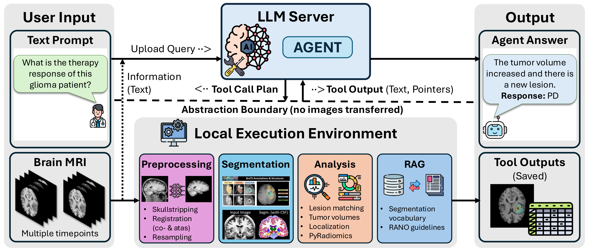

# Brain MRI Agents: Agentic Large Language Models for Neuro-Radiological Image Analysis

[](https://arxiv.org/abs/2604.16729)

A multi-agent neuroimaging analysis framework enabling training-free, multimodal brain MRI processing, segmentation, registration, radiomics extraction, and clinical evaluation (e.g. RANO assessment).



<!-- 📖 **Documentation**: [Overview](README.md) • [Usage Guide](USAGE.md) • [Datasets](dataset/README.md) -->

---

## 📋 Prerequisites

- **Python**: `3.11.5`
- **uv**: Fast Python package and environment manager (`>= 0.4.0`)
- **NVIDIA GPU & CUDA 12.4+**: For accelerated deep learning inference.
- **Docker** (with GPU)
- **API key** from your favorite LLM provider (OpenAI compatible)

If you don't have `uv` installed, install it via:
```bash
curl -LsSf https://astral.sh/uv/install.sh | sh
```

---

## 🚀 Quickstart & Installation

### 1. Clone the Repository
```bash
git clone https://github.com/RadOnc-AI-group/brain-mri-agents.git 
cd brain-mri-agents
```

### 2. Create the Virtual Environment (Python 3.11.5)
Using `uv`, create a project-specific virtual environment pinned to Python 3.11.5:
```bash
uv venv --python 3.11.5 .venv
source .venv/bin/activate
```

### 3. Install Dependencies
Sync all project dependencies using `uv`:
```bash
uv sync
```

---

## 🔑 Configuration & API Keys

Edit `api_keys.yaml` to add your credentials:
```yaml
OPENAI_API_KEY: "your-openai-api-key"
GEMINI_API_KEY: "your-gemini-api-key"
CLAUDE_API_KEY: "your-claude-api-key"

# Weights & Biases / Weave Tracking
WANDB_ENTITY: "your-wandb-username"
WANDB_PROJECT: "brain-mri-agents"
```

---

## 🧠 Usage

Detailed usage guides, input file specifications, CLI arguments, and interactive session commands are available in the **[Usage Guide (USAGE.md)](USAGE.md)**.

### 1) Interactive Single-Session (`weave_single.py`)

Run an interactive multi-agent session in your terminal. Place paths to your desired MRI scans in `patient_files.json`:

```bash
python weave_single.py --patient-files-json patient_files.json --agent-type as_tools --llm gpt-5.4
```

### 2) Batch Benchmark Evaluation (`weave_evaluation.py`)

Evaluate agents across our standard benchmark datasets with [Weights & Biases Weave](https://wandb.ai/site/weave) logging:

```bash
python weave_evaluation.py --task 2 --agent-type as_tools --llm claude-sonnet-4-6 --temperature 0.0
```

<!-- 👉 **For the complete guide on `patient_files.json` format, fields, agent architectures, CLI arguments, and interactive commands, see [USAGE.md](USAGE.md).** -->

## 📄 License
  
- **Software**: The code in this repository is licensed under the [Apache License 2.0](LICENSE).
- **Paper & Media**: The manuscript, figures in `assets/`, and documentation are licensed under [Creative Commons Attribution 4.0 International (CC BY 4.0)](https://creativecommons.org/licenses/by/4.0/).